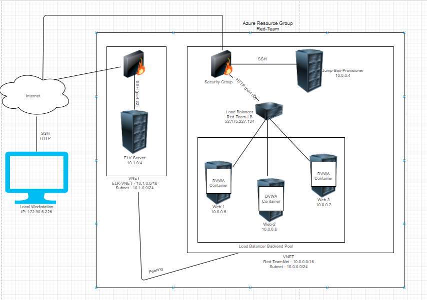
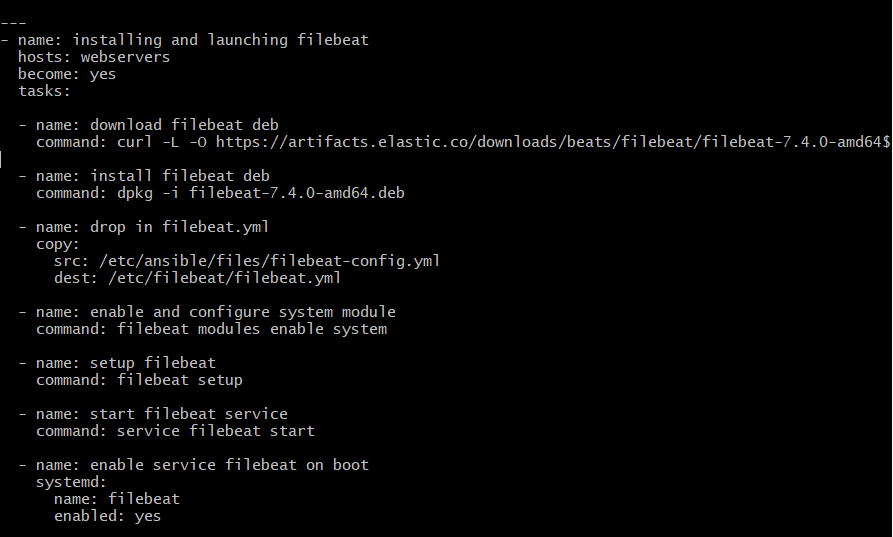
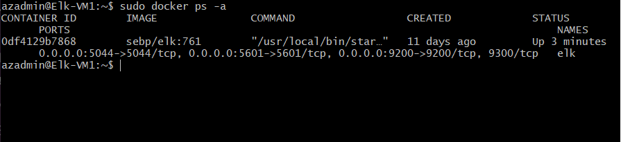

## Automated ELK Stack Deployment

The files in this repository were used to configure the network depicted below.

These files have been tested and used to generate a live ELK deployment on Azure. They can be used to either recreate the entire deployment pictured above. Alternatively, select portions of the .yml file may be used to install only certain pieces of it, such as Filebeat.

 

This document contains the following details:
- Description of the Topology
- Access Policies
- ELK Configuration
  - Beats in Use
  - Machines Being Monitored
- How to Use the Ansible Build

### Description of the Topology

The main purpose of this network is to expose a load-balanced and monitored instance of DVWA, the D*mn Vulnerable Web Application.

Load balancing ensures that the application will be highly efficient, in addition to restricting access to the network.
- Load balancers protect against DDoS attacks. The advantage of a jump box is that it only allows access to an administrator. 

Integrating an ELK server allows users to easily monitor the vulnerable VMs for changes to the network and system logs.
- Filebeat monitors and collects specific log files or locations and sends them to Elasticsearch or Logstash for indexing. 
- Metricbeat records metrics from your systems and services, e.g. CPU, Memory, etc.

The configuration details of each machine may be found below.
| Name                 | Function           | IP Address | Operation System |
|----------------------|--------------------|------------|------------------|
| Jump-Box-Provisioner | Gateway            | 10.0.0.4   | Linux            |
| Web-1                | DVWA Container     | 10.0.0.5   | Linux            |
| Web-2                | DVWA Container     | 10.0.0.6   | Linux            |
| Web-3                | DVWA Container     | 10.0.0.7   | Linux            |
| ELK-VM-1             | Monitoring/Logging | 10.1.0.4   | Linux            |

### Access Policies

The machines on the internal network are not exposed to the public Internet. 

Only the Jump Box Provisioner machine can accept connections from the Internet. Access to this machine is only allowed from the following IP addresses:
- My IP: 172.90.6.225

Machines within the network can only be accessed by the Jump Box Provisioner VM.
- My personal machine, 172.90.6.225, can access the ELK VM through port 5601.

A summary of the access policies in place can be found in the table below.

| Name                 | Publicly Accessible | Allowed IP Address |
|----------------------|---------------------|--------------------|
| Jump-Box-Provisioner | Yes                 | 172.90.6.225       |
| Web-1                | No                  | 10.0.0.4           |
| Web-2                | No                  | 10.0.0.4           |
| Web-3                | No                  | 10.0.0.4           |
| ELK-VM-1             | No                  | 172.90.6.225       |

### Elk Configuration

Ansible was used to automate configuration of the ELK machine. No configuration was performed manually, which is advantageous because...
- Ansible is free and easy to use, agentless, playbooks are written in YAML and can be found in the Ansible Galaxy. 

The playbook implements the following tasks:
- Installs Docker
- Installs Python
- Creates Elk container
- Specificies open ports

The following screenshot displays the result of running `docker ps` after successfully configuring the ELK instance.

### Target Machines & Beats
This ELK server is configured to monitor the following machines:
- Web 1 - 10.0.0.5
- Web 2 - 10.0.0.6
- Web 3 - 10.0.0.7 

We have installed the following Beats on these machines:
- Filbeat and Metricbeat

These Beats allow us to collect the following information from each machine:
- Filebeat monitors specific log files and locations and send them to Elasticsearch or Logstash. For example, you can have Filebeat watch for an "error" and have it sent to Logstash. 
- Metricbeat collects metrics from the operating system or running services and sends them forwards them to a specified output. For example, it can collect CPU usage and send it to either Elasticsearch or Logstash. 

### Using the Playbook
In order to use the playbook, you will need to have an Ansible control node already configured. Assuming you have such a control node provisioned: 

SSH into the control node and follow the steps below:
- Copy the filebeat-playbook.yml file to /etc/ansible/roles.
- Update the /etc/ansible/hosts file to include IP addresses of the Elk Server and Web VMs.
- Run the playbook, and navigate to http://(Elk VM's public IP):5601/app/kibana to check that the installation worked as expected.

_As a **Bonus**, provide the specific commands the user will need to run to download the playbook, update the files, etc._
